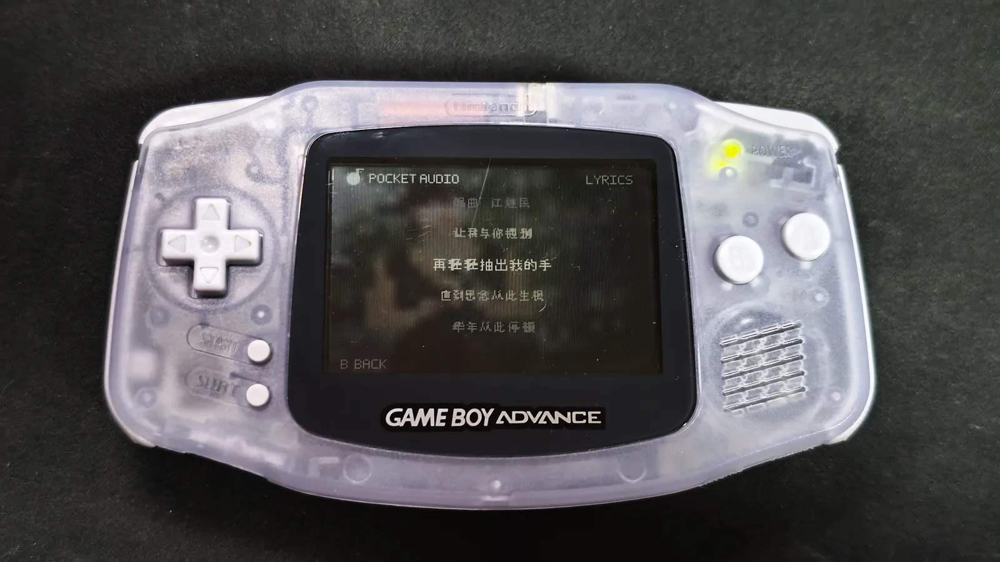

# Pocket Audio

[简体中文](README_CN.md)

**Pocket Audio** is a browser-based music ROM builder and player for the **Game Boy Advance**.

It lets you import music, edit metadata, add artwork and synchronized lyrics, preview the final GBA interface in the browser, and build a standalone `.gba` ROM that can run in an emulator or on real hardware.

> Current development line: **Pocket Audio Builder 0.16.x**  
> Latest documented builder artifact: **0.16.2**

## What is already implemented

### Browser-based ROM builder

Pocket Audio currently runs as a self-contained browser tool. The builder can:

- Import multiple songs.
- Read common audio formats such as MP3, WAV, OGG, FLAC and M4A/AAC when supported by the browser.
- Read song metadata and embedded artwork from supported files.
- Edit song title and artist information.
- Add, replace or remove cover artwork.
- Reorder and remove tracks.
- Estimate the space used by each track and the final ROM.
- Build a standalone `.gba` file directly from the browser.

The current ROM builder respects the standard **32 MiB GBA ROM limit** and reports when a project would exceed it.

### ROM-accurate player preview

The editor contains a **240×160 preview** designed to behave like the generated ROM rather than acting as a generic web music player.

The current preview includes:

- Play / pause.
- Previous / next track.
- ±5 second seeking.
- Lyrics screen.
- Playback mode switching.
- Track-change transitions.
- Scrolling title and artist text.
- Album-art-based blurred background rendering.

Keeping the browser preview and the real ROM visually and behaviorally consistent is one of the main goals of the project.

### Synchronized lyrics

Pocket Audio already supports synchronized lyrics in the generated ROM.

Supported lyric inputs include:

- `.lrc`
- `.srt`
- `.txt`

Lyrics are preprocessed by the builder into GBA-friendly data and rendered by the ROM runtime. The player includes a dedicated lyrics screen and automatically follows the current playback position.

### Multi-song playback

Multi-track ROMs currently support three playback modes:

- Playlist loop.
- Single-track loop.
- Shuffle.

Playback mode is switched with `SELECT` on the GBA.

For a ROM containing only one song, Pocket Audio intentionally removes unnecessary playback-mode behavior: the mode indicator is hidden, `SELECT` does nothing, and playback stops/pauses when the song ends.

### Configurable audio output

The builder currently provides three GBA PCM output choices:

| Setting | Intended use |
| --- | --- |
| 11 kHz | Smaller ROM size |
| 16 kHz | Recommended balance |
| 22 kHz | Higher audio quality |

The generated player uses **GBA Direct Sound PCM** playback.

### Real hardware testing

Pocket Audio is not only an emulator-side experiment. Development builds have been tested on an actual Game Boy Advance through a flash cartridge, including music playback, artwork, UI transitions and synchronized lyrics.

## Current controls

| Control | Action |
| --- | --- |
| `A` | Play / pause |
| `B` | Open / close lyrics |
| `Left / Right` | Seek backward / forward |
| `L / R` | Previous / next track |
| `SELECT` | Change playback mode in multi-song ROMs |

Controls may continue to change while the project is in development.

## How Pocket Audio works

Pocket Audio does **not** try to decode modern desktop audio codecs directly on the GBA.

Instead, the browser builder handles the expensive work in advance:

1. Import and decode the source audio.
2. Read metadata and artwork.
3. Prepare the cover, background and text assets.
4. Parse and preprocess synchronized lyrics.
5. Convert audio into a GBA-friendly PCM representation.
6. Pack the songs and assets into the player ROM.
7. Output a ready-to-run `.gba` file.

This approach keeps the GBA runtime small and predictable while still allowing the user to start with ordinary music files.

## Current development priorities

### Short term

- Remove the last visible lyric-animation flicker and fast-scroll edge cases.
- Keep the builder preview and ROM behavior as close as possible.
- Improve playback and transition stability on real hardware.
- Continue testing different songs, lyric densities and ROM sizes.
- Improve the audio-quality / ROM-size tradeoff.
- Clean the development files and prepare the first public source package.
- Add reproducible build notes and example projects.

### Later

- More efficient audio storage to fit more or higher-quality music into a ROM.
- Better project save/load workflows.
- Additional customization without making the GBA runtime heavy.
- Broader flash-cart and emulator compatibility testing.

## Project status

Pocket Audio is actively developed and already produces functional GBA music-player ROMs, but it is **not yet considered a stable release**.

The first public source release will be prepared after the current builder/runtime is cleaned, documented and tested as a reproducible package.

## License

Pocket Audio is **source-available, not open-source under MIT/GPL/Apache**.

You may use the official Pocket Audio tool to create GBA ROMs, including ROMs containing your own music, artwork and lyrics. Generated ROMs remain subject to the rights of the content you put into them.

Modification, redistribution or commercial reuse of Pocket Audio's source code is not permitted without separate permission. See [LICENSE](LICENSE) for the exact repository terms.

Third-party components, if any, remain under their own licenses.

## Disclaimer

Pocket Audio is an independent project and is not affiliated with or endorsed by Nintendo.

Game Boy Advance and GBA are trademarks of Nintendo.
