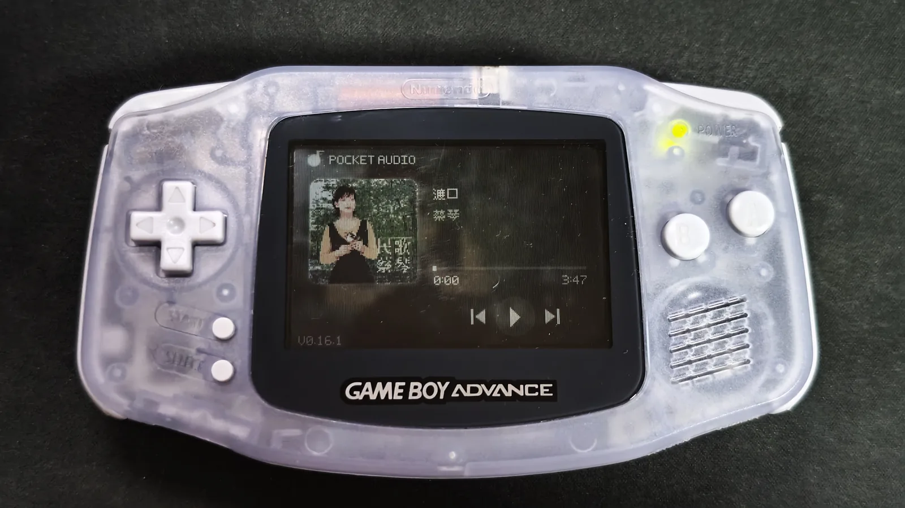

# Pocket Audio

[English](README.md)

**Pocket Audio** 是一个面向 **Game Boy Advance** 的浏览器音乐 ROM 制作器与播放器。

它的目标是让制作 GBA 音乐 ROM 更接近使用一个小型音乐制作工具：导入普通音频文件，准备歌曲信息、封面和同步歌词，在浏览器中预览播放器，然后直接生成能够在模拟器或真实 GBA 上运行的 `.gba` ROM。

> **项目状态：** 持续开发中。已经能够在真实 GBA 硬件上运行，但目前还不是稳定正式版。

## 真机运行

Pocket Audio 已经通过烧录卡在真实 Game Boy Advance 上运行。当前 ROM 播放器已经能够显示核心音乐播放器界面、封面、播放控制和歌曲信息。

  

<em>Pocket Audio 播放器在真实 GBA 硬件上运行。</em>

## 已经实现的功能

### 浏览器 ROM 制作器

当前 Builder 已经可以：

- 导入多首歌曲。
- 在浏览器支持的情况下读取 MP3、WAV、OGG、FLAC、M4A/AAC 等常见音频格式。
- 读取支持格式中的歌曲元数据和内嵌封面。
- 编辑歌名和歌手信息。
- 添加、更换或移除封面。
- 调整歌曲顺序、删除歌曲。
- 以 GBA 原生 **240×160** 分辨率预览播放器。
- 估算单曲和最终 ROM 所占空间。
- 直接在浏览器中生成独立 `.gba` ROM。
- 在项目超过标准 **32 MiB GBA ROM 上限**时进行提示。

预览器不是普通网页音乐播放器，而是围绕最终 ROM 来设计。我们的目标是让 Builder 中看到的切歌动画、文字滚动、按键逻辑和歌词行为尽量与真正生成的 GBA ROM 保持一致。

### 音频播放

Pocket Audio 当前不会尝试让 GBA 直接解码现代桌面音频格式，而是在生成 ROM 之前将音频转换成适合 **GBA Direct Sound PCM** 播放的数据。

当前提供三档输出设置：

| 设置 | 用途 |
| --- | --- |
| 11 kHz | 更节省 ROM 空间 |
| 16 kHz | 推荐的平衡档 |
| 22 kHz | 更高音质 |

这样可以把耗时的转换工作放在浏览器端，让 GBA 端播放器保持简单、稳定和可预测。

### 同步歌词

Pocket Audio 已经可以把同步歌词真正打包进生成的 ROM。

当前支持：

- `.lrc`
- `.srt`
- `.txt`

Builder 会在生成 ROM 之前预处理歌词时间和显示数据。GBA 播放器拥有独立歌词界面，并根据当前播放进度自动跟随歌词。

  

<em>同步歌词在真实 GBA 硬件上运行。</em>

### 多曲播放

多曲 ROM 当前支持：

- 列表循环
- 单曲循环
- 随机播放

当 ROM 中有多首歌曲时，通过 `SELECT` 切换播放模式。

如果 ROM 里只有一首歌，Pocket Audio 会移除没有意义的模式 UI 和切换逻辑：不显示播放模式图标，`SELECT` 不循环切换模式，歌曲播放完成后直接停止 / 暂停。

### 播放器界面与逻辑

目前已经实现的播放器功能包括：

- 播放 / 暂停。
- 上一首 / 下一首。
- 前后跳转。
- 封面显示。
- 歌名与歌手信息。
- 长文字滚动。
- 根据封面生成的背景表现。
- 切歌过渡动画。
- 独立歌词界面。
- 多曲 ROM 的播放模式显示。
- 尽量与 ROM 保持一致的浏览器预览。

## 当前按键

| 按键 | 功能 |
| --- | --- |
| `A` | 播放 / 暂停 |
| `B` | 打开 / 返回歌词界面 |
| `Left / Right` | 后退 / 前进 |
| `L / R` | 上一首 / 下一首 |
| `SELECT` | 多曲 ROM 中切换播放模式 |

项目仍在开发中，因此按键设计未来仍可能调整。

## Pocket Audio 的工作方式

大部分耗时工作都会在 ROM 到达 GBA 之前完成：

1. 在浏览器中导入并解码源音频。
2. 读取可用的歌曲信息和封面。
3. 预处理封面、背景和文字资源。
4. 解析并预处理同步歌词。
5. 将音频转换成适合 GBA 的 PCM 数据。
6. 将歌曲与资源打包进播放器数据。
7. 生成并下载可以直接运行的 `.gba` ROM。

因此 GBA Runtime 可以把性能集中在播放、绘制、输入和时间同步上，而不是运行时解码复杂的源音频格式。

## 当前开发重点

目前的重点比起疯狂增加新功能，更偏向打磨、稳定性和效率。

### 接下来

- 彻底修掉歌词动画剩余的闪烁和快速滚动边缘问题。
- 继续让浏览器预览的时序和 ROM 实际行为尽量一致。
- 使用更多歌曲和不同歌词密度继续进行真机测试。
- 提升播放和过渡动画稳定性。
- 继续优化音质与 ROM 体积之间的平衡。
- 整理源码目录，为第一个公开开发版本做准备。
- 补齐可复现的构建说明和测试材料。

### 之后

- 更高效的音频存储方式，让一个 ROM 能装更多音乐或更高音质。
- 更完整的项目保存 / 读取流程。
- 在不明显增加 GBA Runtime 负担的前提下提供更多自定义能力。
- 扩大模拟器和烧录卡兼容性测试。
- 增加制作、验证 Pocket Audio ROM 的辅助工具。

只有当一个功能在最终生成的 ROM 中也能正确工作时，我们才会把它视为真正完成。

## 项目状态

Pocket Audio 已经能够生成可用的 GBA 音乐播放器 ROM，并且已经在真实硬件上测试，但项目仍处于持续开发阶段。

等 Builder 和 ROM Runtime 完成源码整理、文档和可复现打包后，再发布第一个正式公开源码版本。

## 许可证

Pocket Audio 当前采用**源码可见（Source-Available）**方式，并不是 MIT、GPL 或 Apache 意义上的开源项目。

你可以使用官方 Pocket Audio 工具制作自己的 GBA ROM，包括加入你自己的音乐、封面与歌词。生成 ROM 中内容的权利仍然由相应内容本身的版权和许可证决定。

未经单独授权，不允许修改、重新分发或商业复用 Pocket Audio 的源代码。具体条款请见 [LICENSE](LICENSE)。

第三方组件（如有）仍然遵循各自的许可证。

## 声明

Pocket Audio 是独立项目，与 Nintendo 没有隶属、合作或官方认可关系。

Game Boy Advance 与 GBA 是 Nintendo 的商标。
